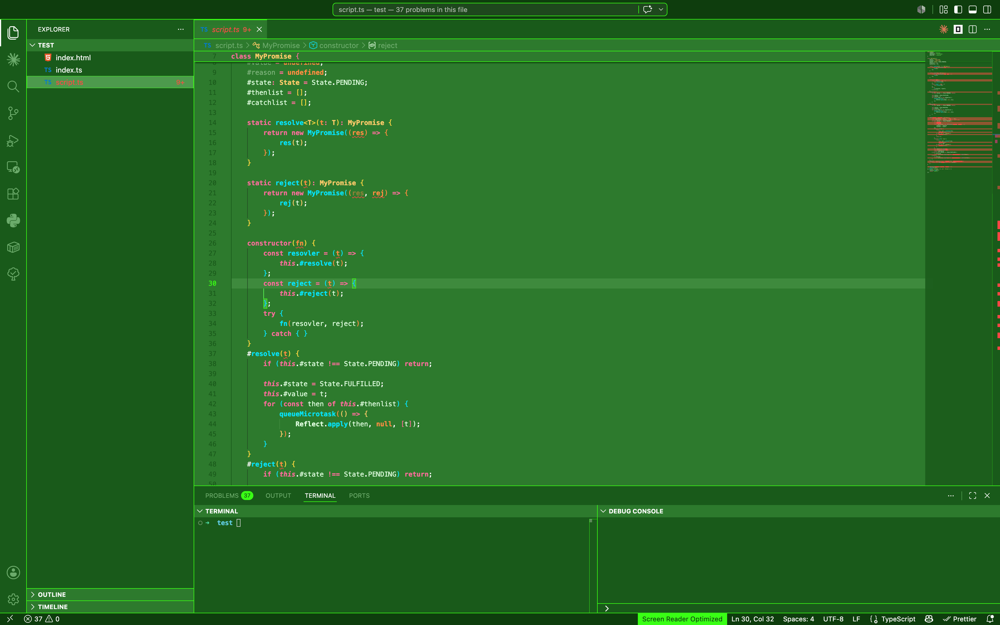
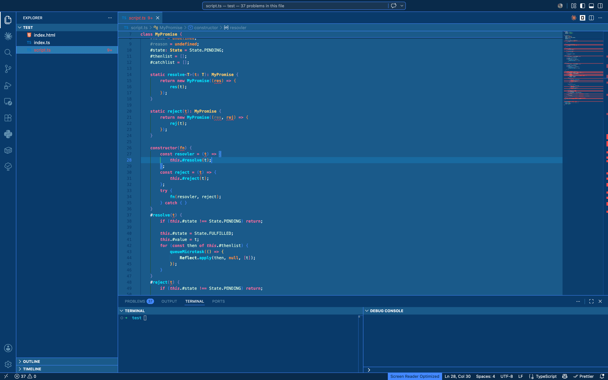
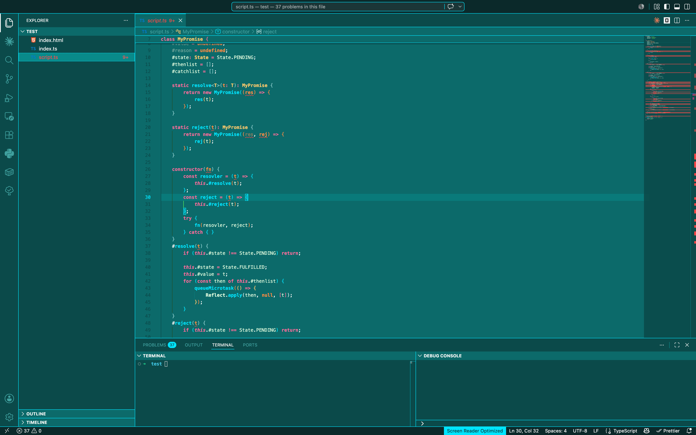
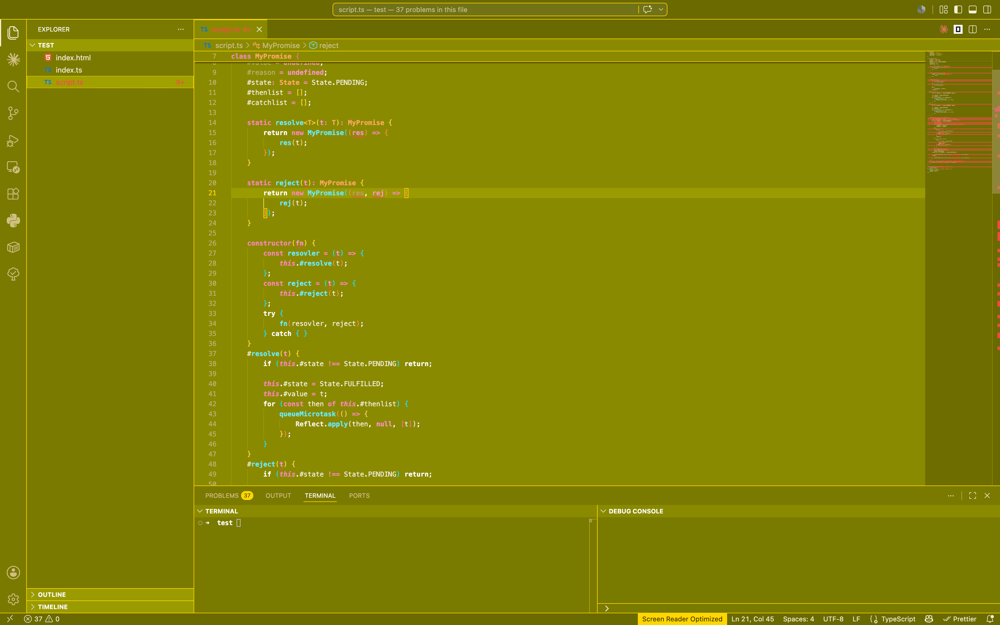
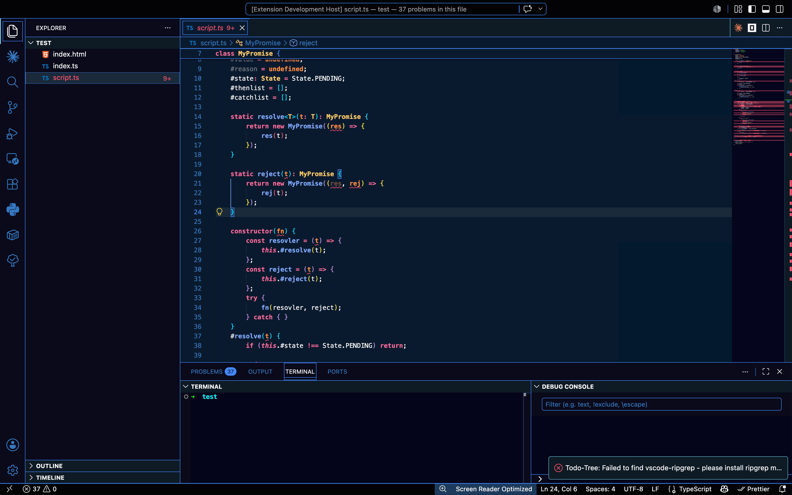
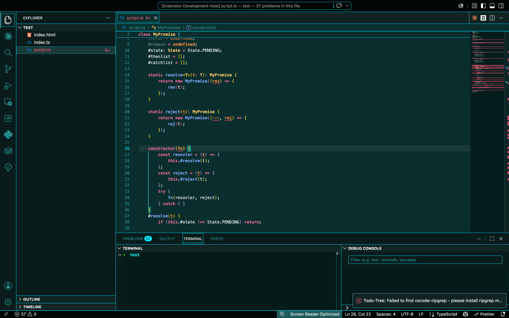
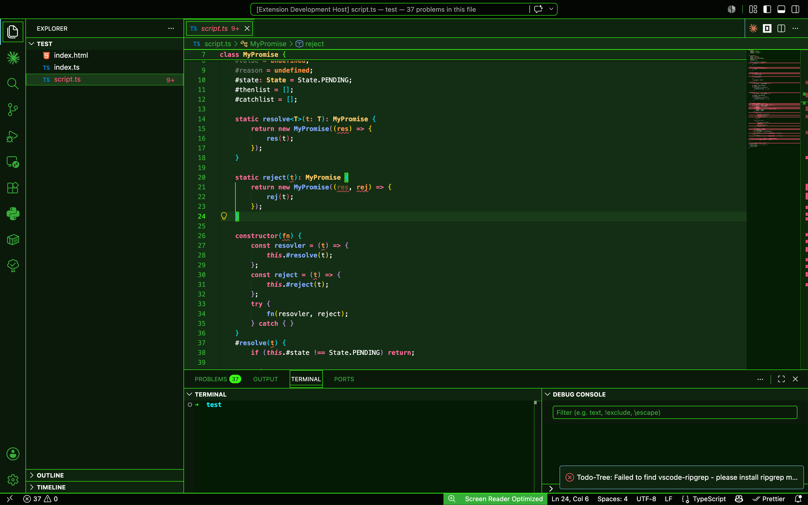
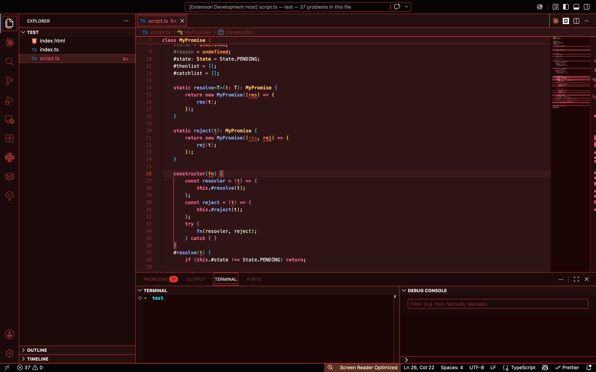
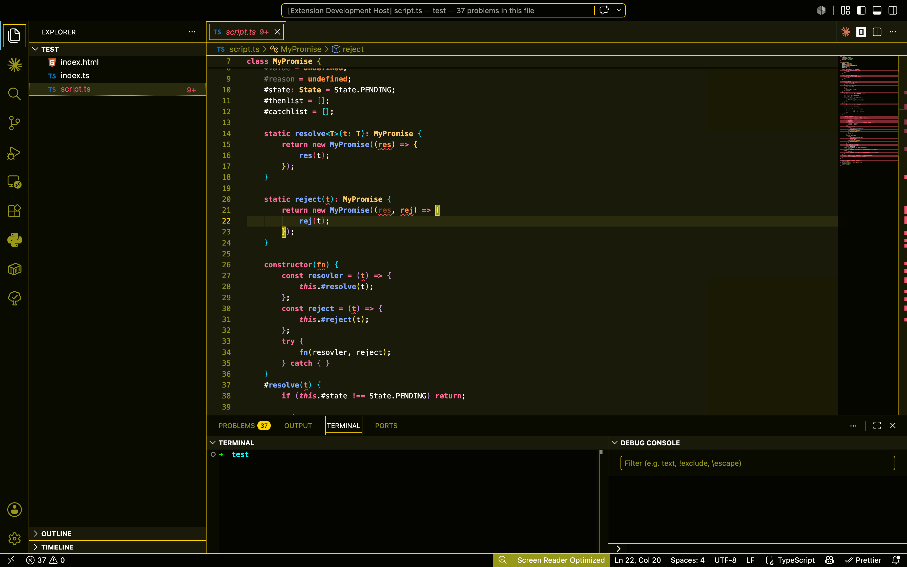
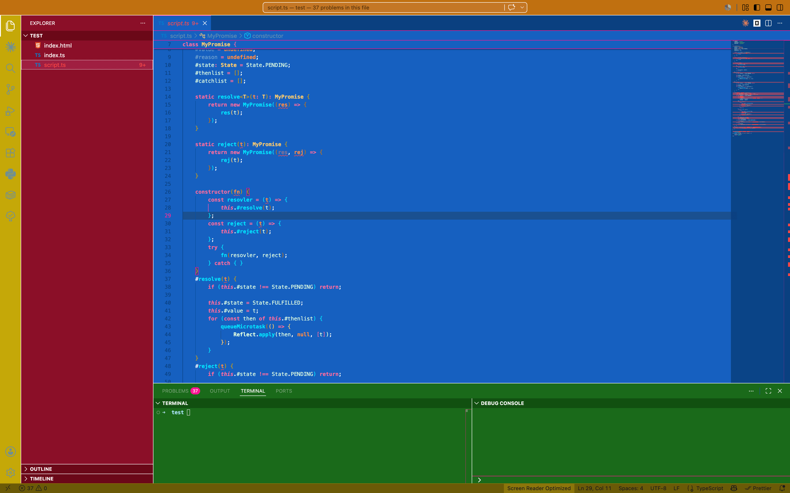

# Explosive Theme

> [English](README.md) | [简体中文](README_CN.md)

Visual Studio Code 的 10 款霓虹风格亮色主题合集，涵盖绿色、蓝色、青色、黄色等多种配色方案，并提供高对比度变体及多色混合主题。

## 包含的主题

### 暗色主题 (vs-dark)
- **Explosive Green Dark** — 绿色主导配色，搭配霓虹强调色
- **Explosive Blue Dark** — 冷蓝色调色板，搭配醒目高亮
- **Explosive Cyan Dark** — 青绿色调色板，搭配明亮强调色
- **Explosive Yellow Dark** — 暖黄色调色板，搭配金色高亮
- **Explosive Mixed** — 多色混合调色板，融合多种色调

### 高对比度主题 (hc-black)
- **Explosive High Contrast Green** — 深绿色搭配高可见度强调色
- **Explosive High Contrast Red** — 深红色搭配醒目高对比度高亮
- **Explosive High Contrast Yellow** — 深黄色搭配最大可读性
- **Explosive High Contrast Blue** — 深蓝色搭配明亮强调色
- **Explosive High Contrast Cyan** — 青绿色搭配生动高亮

## 安装方法

1. 打开 VS Code
2. 进入扩展面板 (`Ctrl+Shift+X` / `Cmd+Shift+X`)
3. 搜索 **Explosive Theme**
4. 点击 **安装**

或通过命令行直接安装：

```bash
code --install-extension yanni4night.explosive-theme
```

激活主题：`文件 > 首选项 > 主题 > 颜色主题`，或使用命令面板 (`Ctrl+Shift+P` / `Cmd+Shift+P`)。

## 截图












## 许可证

MIT 许可证 — 详见 [LICENSE](LICENSE) 文件。

## 问题反馈

发现 Bug 或有建议？在 GitHub 上 [提交 Issue](https://github.com/yanni4night/vscode-explosive-theme/issues)。
